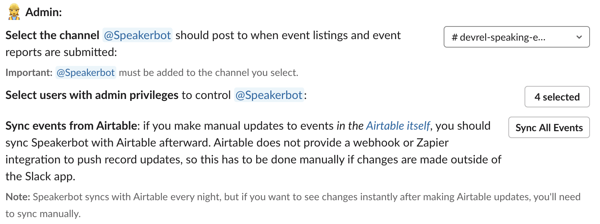

# Speakerbot Admin

Speakerbot supports `admin` users, who have a few select additional capabilities. The Admin section of their [App Home](slack://app?team=T6VN36NMP&id=A0157QBDE49&tab=home) looks like this:

## Select Channel Speakerbot Posts In

Admins can **select an existing Slack channel where Speakerbot should output** weekly roundups, new events, new reports, and public notifications. Once a channel has been selected, the `@Speakerbot` Slack bot must be invited into the channel in order to be able to post there.

## Select Users with Admin Privileges

Admins can also **add (or remove) other admins**. Users can be selected (or removed) from a list of all available users in the Slack team workspace.

## Sync Events From Airtable

Ostensibly, admins should also be the users with access to the Airtable where Speakerbot reads and writes event data. When changes are made directly in the Airtable table, those changes _do not automatically get propagated back to Speakerbot_. This is because (as of this writing) [Airtable does not natively provide sufficient webhooks for record events](https://community.airtable.com/t/webhooks-for-records/1966).

As a consequence, _manual updates made directly in the Airtable_ will **not** be synced with the Slack app except when data is pulled, meaning that operations _Speakerbot_ performs when changes are made (such as scheduling event followups, posting to channels, sending DMs upon successful submission, or updating user App Home views) will not run if Airtable records are added or modified outside Slack.

To help mitigate this, Speakerbot syncs events with Airtable automatically every night, but if an admin user makes changes in the Airtable and would like to see their changes reflected in Speakerbot immediately, they must click the admin button to **Sync All Events** after directly manipulating Airtable records. (This is not an issue with any changes that are made to events via Speakerbot in Slack.)

> **Note:** Just-in-time notifications that Slack outputs in direct response to changes will _not_ run when Airtable records are added or modified outside Slack under any circumstance (e.g., "new event added" output to channel). Followups _will_ be rescheduled and App Home views will be updated, however.
