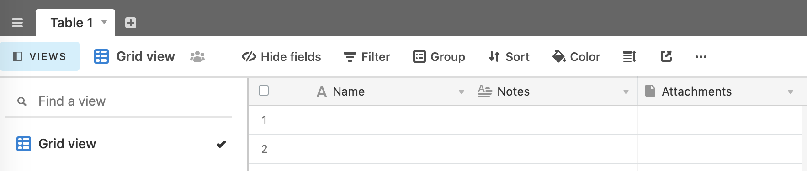
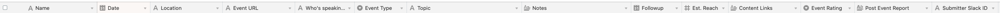
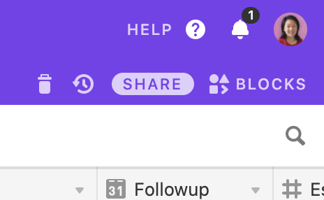

# Development: Airtable Setup

You should already have an [Airtable](https://airtable.com) account, as detailed in the [Prerequisites](development.md#prerequisites).

Now we need to set up a base and table to store events and event reports.

1. [Log into Airtable](https://airtable.com/login). The dashboard defaults to the Bases view.
2. Click the `+` icon to `Add a base`.
3. In the dropdown, choose **Start from scratch**.
4. Name your base something descriptive. A base is a _collection_ of tables, and we'll use a table inside this base to store speaking events. You can also select a color and an icon for your base.
5. Once your base is set up, click on it to open it. You will see an empty table in grid view. It should look something like this:

6. Rename "Table 1" to a name of your choosing. This will be the table where Speakerbot saves and reads data. For example, this table might be called `Speaking Events`.
7. Modify/add the table fields as described below. It's very important that the fields be named and formatted _exactly_ as shown, otherwise, the app will not be able to read or save the data properly without further code edits:
  * **Name** | Single line text
  * **Date** | Date | Date format: `ISO (2020-06-16)`
  * **Location** | Single line text
  * **Event URL** | URL
  * **Who's speaking?** | Single line text
  * **Event Type** | Single select
    * `Conference`
    * `Workshop`
    * `Meetup`
    * `Podcast`
    * `Work event`
    * `Livestream`
    * `Webinar`
    * `Other`
  * **Topic** | Single line text
  * **Notes** | Long text (no rich text formatting)
  * **Followup** | Date | Date format: `ISO (2020-06-16)`
  * **Est. Reach** | Number | Format: `Integer (2)` (do not allow negative numbers)
  * **Content Links** | Long text (no rich text formatting)
  * **Event Rating** | Single select
    * `1`
    * `2`
    * `3`
    * `4`
  * **Post Event Report** | Long text (enable rich text formatting)
  * **Submitter Slack ID** | Single line text
  * _**Quarter**_ | Formula: `DATETIME_FORMAT(Date,'Q')` | _optional; for grouping / sorting_
  * _**Report Completed**_ | Formula: `IF({Post Event Report},"Yes","No")` | _optional; for grouping / sorting_
8. When finished, your table's column headings should look like this:

9. Add your table's name to your `.env` file in the `AIRTABLE_TABLE` variable.
10. Examine the table's URL in the browser. It should look something like this: `https://airtable.com/[tblXXXxxx]/[viwXXXxxx]?blocks=...`
11. Copy the segment of the URL that begins with "tbl" to `.env` as the `AIRTABLE_TABLE_ID` variable.
12. Copy the segment of the URL that begins with "viw" to `.env` as the `AIRTABLE_VIEW_ID` variable. (It should be the "Grid view.")
13. In the upper right of your base view, you should see an icon of a question mark: `(?)`.
<br>
Click on this link and in the dropdown, choose **API Documentation**. This opens the API docs for your base.
14. In the Airtable API Introduction section, find the line that says:
```
The ID of this base is appXXXXXX.
```
15. Copy the base ID and paste it into your `.env` file as the `AIRTABLE_BASE_ID` variable.
16. Now return to your base view. In the upper right corner, click on your avatar icon and choose **Account** from the dropdown.
17. You should now see your **Account overview** page. In the "API" section, you should see a prompt to generate an API key. After you've done this, there is a personal API key (displayed as dots in an input field). Click in the field to view the text contents. It should reveal a string starting with "key." Copy this API key and paste it into your `.env` file as `AIRTABLE_API_KEY`.
18. Save your `.env` changes.

You are now ready to use Airtable as your data source for events! Head back to the [Development docs](development.md) or you can move to the next step: [Development: MongoDB Setup](development-mongodb.md).